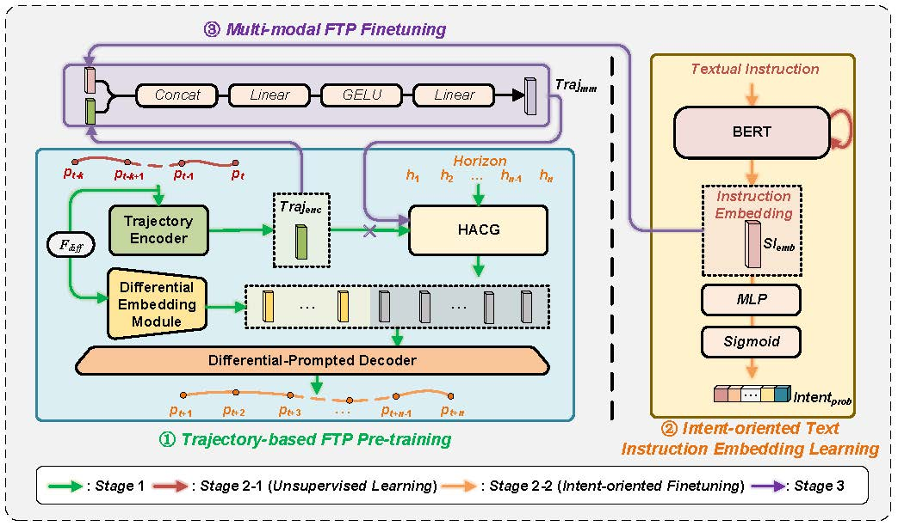

# Integrating human factors into automation process in air traffic control: intent-driven flight trajectory prediction


# Introduction

This repository provides source codes of the proposed spoken instruction aware flight trajectory prediction (SIA-FTP) framework. 

<p  align="middle"></p>

## Repository Structure
```
IntentDrivenFTP
| README.md (the current README file)
| LICENSE (LICENSE file)
├─Stage1
│  └─README.md (the README file for the Stage1) 
│  
├─Stage2
│  │ BERT_PreTrain.py (traning file for the unsupervised BERT model)
│  │ config.py (configration of the models in stage2)
│  │ train.py (traning file for the IID model) 
│  │ utils.py (tools for the project)
│  └─data (example data for the intent-oriented instruction embedding learning)
│     └─example_data.csv (Example data file)
│ 
├─Stage3
│  │ config.json (config file using json format)
│  │ dataloader.py (load traning trajectory data)
│  │ model.py (the neural architecture corresponding to the FlightBERT++ framework)
│  │ run.py (the main file for the model training and testing)
│  │ utils.py (tools for the project)
|  └─data
│     │ example_data.txt (an example of manifest)
│     └─trajectory
│           │ test1.csv (an of example trajecotry data file)
│           └─test2.csv (an of example trajecotry data file)
└─pics

```

## Package Requirements

+ Python == 3.7.1
+ torch == 1.9.0 + cu110
+ numpy == 1.18.5
+ matplotlib == 3.2.1
+ transformers == 4.10.0

## System Requirements
+ Ubuntu 16.04 operating system
+ Intel(R) Core(TM) i7-7820X@3.6GHz CPU
+ 128G of memory
+ 8TB of hard disks
+ 8 $\times$ NVIDIA(R) GeForce RTX(TM) 2080 Ti 11G GPUs.


# Instructions
## Installation

### Clone this repository

```
git clone https://github.com/gdy-scu/IntentDrivenFTP.git
```

### Create proper software and hardware environment

You are recommended to create a virtual environment with the package requirements mentioned above, and conduct the 
training and test on the suggested system configurations.

## Training and Testing
In this work, a 3-stage progressive multi-modal learning paradigm is proposed to address the modality gap between the structured trajectory and unstructured spoken instructions, as well as minimize the data requirements, including trajectory-based FTP pre-training, intent-oriented instruction embedding learning, and multi-modal fine-tuning.

### Stage1 
Our previous work FlightBERT++ serves as the prediction framework to conduct the intent-driven FTP task. 
The code implementation and detailed instructions can be found in <a href="https://github.com/gdy-scu/FlightBERT_PP">FlightBERT++</a>. 

### Stage2 
To pre-train the BERT model, use the following command.

```
cd Stage2/
python BERT_PreTrain.py
```

To train the IID model, use the following command.

```
cd Stage2/
python train.py
```

### Stage3
The training and testing are both packaged into the script of `run.py` for the SIA_FTP framework with the different arguments in `config.json`. 

The main arguments in `config.json` are descirbed bellow:

`learning_rate`: Float. The learning rate of the Adam optimizer. `default=0.0001`

`period`: Integer. The sampling period for dataloader. `default=5`

`batch_size`: Integer. The number of samples in a single training batch. `default=256`

`epoch`: Integer. The maximum epoch for training process. `default=100`

`train_data`: String. The manifest for training set. `default='./data/train.csv'`

`dev_data`: String. The manifest for validation set. `default='./data/dev.csv'`

`test_data`: String. The manifest for test set. `default='./data/test.csv'`

`saving_dir`: Integer. The save path of the models and log file during the training/testing process. `default='./check_points/'`

`n_en_layer`: Integer. The layer number of the Transformer block in the encoder. `default=4`

`n_de_layer`: Integer. The layer number of the Transformer block in the decoder. `default=4`

`horizon`: Integer. The prediction horizons of the flight trajectory prediction task. `default=15`

`is_training`: Bool. Used to specify the running mode, true for training and false for testing. `default=true`

`use_text_emb`: Bool. Integrating the spoken instruction or not. `default=true`

`ftp_model_path`: String. The checkpoint model path for trajectory-based pretraning. `default=''`

`iid_model_path`: String. The checkpoint model path for IID model. `default=''`

`model_path`: String. The checkpoint model path for SIA-FTP model. `default=''`


To train the SIA-FTP framework, use the following command.

```
cd Stage3/
python run.py --config ./config.json
```

## Test

To test the model, set `is_training` to false and set the `model_path` to the specific test model (`config.json`), and run the following command.

```
cd Stage3/
python run.py --config ./config.json
```

# Dataset

In this repository, the example samples are provided for facilitate quick start. 

# Contact

Dongyue Guo (dongyueguo@stu.scu.edu.cn)